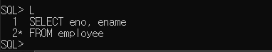
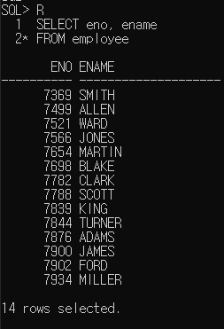
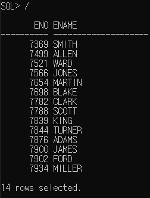
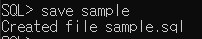
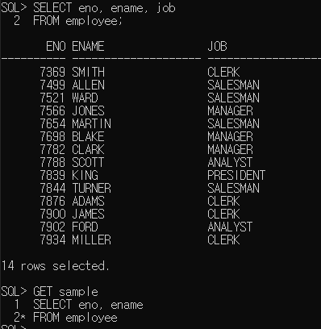
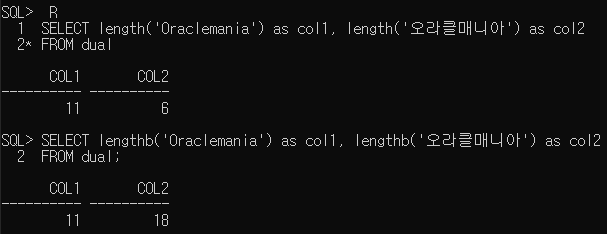
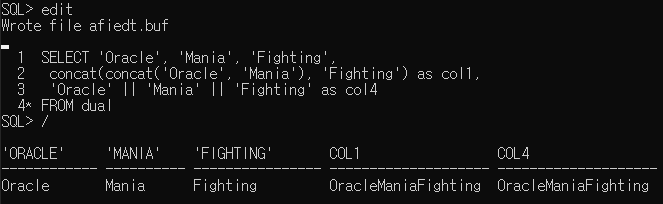
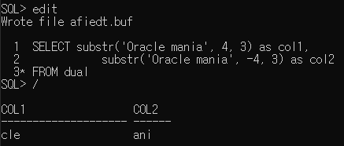
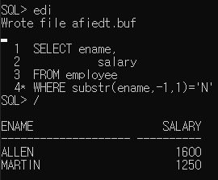
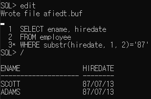

학습 일자 : 2022.04.26  
학습 목표

1. SQL Plus의 개념 이해
2. SQL의 종류를 학습
3. 문자형 데이터를 처리하는 함수를 학습

---

### SQL\*Plus

- SQL 문을 대화식으로 실행하기 위해서 사용자가 데이터베이스에 입력하고 SQL 문을 처리하여 그 결과를 받을 수 있도록 만든 툴

### SQL(Structured Query Language)

- 테이블을 저장 단위로 생각하는 관계형 데이터베이스(Relational DataBase:RDB)를 처리(저장, 수정, 삭제, 추출)하기 위해 미국표준협회(ANSI)에서 표준으로 채택한 언어

---

### SQL과 SQL Plus 명령어의 차이점

| SQL 명령문                           | SQL Plus 명령문                            |
| ------------------------------------ | ------------------------------------------ |
| 관계형 데이터베이스의 ANSI 표준 언어 | SQL 명령문을 실행 시킬 수 있는 오라클의 툴 |
| 여러 줄 실행                         | 한줄 실행                                  |
| 종결문자(;) 필요                     | 종결문자 불필요                            |
| 연결문자 불필요                      | 연결문자(-) 필요                           |
| 키워드 단축 불가                     | 키워드 단축 가능                           |
| 버퍼에 마지막 명령문 저장            | 버퍼 저장 안함                             |

---

### SQL Plus 명령어

| 명령어         | 기능                                                        |
| -------------- | ----------------------------------------------------------- |
| LIST (L)       | 버퍼에 저장된 모든 SQL문 또는 검색한 라인의 SQL 문을 나타냄 |
| RUN (R)        | 버퍼에 저장된 SQL 문을 보여주고 실행                        |
| /              | 버퍼에 저장된 SQL문을 보여주지 않고 바로 실행               |
| SAVE filename  | SQL 버퍼 내의 현재 내용을 파일에 저장                       |
| EDIT filename  | 파일의 내용을 메모장으로 읽어 편집할 수 있도록 함           |
| @filename      | SQL 파일에 저장된 내용을 실행                               |
| SPOOL filename | 오라클 화면을 갈무리하여 파일로 저장                        |
| GET filename   | 파일의 내용을 SQL 버퍼로 읽어 들임                          |
| SHOW           | Setting 정보를 확인할 수 있음                               |

### 사용 예

- LIST 명령어  
  

- RUN 명령어  
  

- / 명령어  
  

- SAVE 명령어  
    
  _HOST명령어로 CMD창으로 넘어가서 DIR \*.sql로 저장된 파일 확인 가능_

- GET 명령어  
  

- SPOOL 명령어  
  SPOOL filename 를 입력하여 갈무리 시작
  일련의 작업이 다 끝나면 SPOOL OFF 입력  
  _HOST명령어로 CMD창으로 넘어가서 DIR \*.lst로 filename.lst 확인 가능_

- SHOW 명령어  
  SHOW뒤에 옵션을 넣어서 각종 정보를 조회할 수 있음  
  _SHOW ALL 하면 모든 정보 조회 가능_

- SET 명령어  
  각각의 설정값을 셋팅할 수 있음  
  _SET linesize, SET pagesize 등_

---

### 화면 출력 포멧 변경

- SET linesize 130  
  화면의 테이블 가로길이를 130으로 변경

- SET pagesize 100  
  화면의 테이블 세로길이를 100으로 변경

- COLUMN 칼럼명 FORMAT 포멧형식

  - `COLUMN ename FORMAT a10`  
    ename 칼럼의 문자길이를 10으로 변경

  - `COLUMN salary FORMAT $9,999,999`  
    salary 칼럼의 출력형식을 $표시하고 자릿수마다 ,로 구분

  - `COLUMN salary FORMAT L9,999,999`  
    _L: local의 의미_  
    salary 칼럼의 출력형식을 해당지역의 통화로 표시하고 자릿수마다 ,로 구분

  - `COLUMN salary FORMAT L0,000,000`  
    _빈공간은 0으로 채움(위조방지)_

  - `COLUMN salary OFF`  
    해당 칼럼의 포멧을 끔

  - `COLUMN salary ON`  
    해당 칼럼의 포멧을 다시 적용

  - `COLUMN salary CLEAR`  
    해당 칼럼의 포멧을 적용하기 전으로 되돌림

---

### 함수를 사용할 때 주의사항

1. args의 타입을 맞춰줘야 함
2. args의 갯수를 맞춰줘야 함

### 문자 처리 함수

| 구분    | 설명                                           |
| ------- | ---------------------------------------------- |
| LOWER   | 소문자로 변환                                  |
| UPPER   | 대문자로 변환                                  |
| INITCAP | 첫 글자만 대문자로 나머지 글자는 소문자로 변환 |

```sql
SELECT ename, eno
FROM employee
WHERE lower(ename)='scott';
```

_여기서 lower(ename)는 오라클이 가상칼럼을 자동으로 만들어서 처리한다._

| 구분    | 설명                           |
| ------- | ------------------------------ |
| LENGTH  | 문자의 길이를 반환(한글 1byte) |
| LENGTHB | 문자의 길이를 반환(한글 3byte) |



| 구분       | 설명                                                         |
| ---------- | ------------------------------------------------------------ |
| CONCAT     | 문자의 값을 연결                                             |
| SUBSTR     | 문자를 잘라 추출 (한글 1byte)                                |
| SUBSTRB    | 문자를 잘라 추출 (한글 3byte)                                |
| INSTR      | 특정 문자의 위치 값을 반환 (한글 1byte)                      |
| INSTRB     | 특정 문자의 위치 값을 반환 (한글 3byte)                      |
| LPAD, RPAD | 입력 받은 문자열과 기호를 정렬하여 특정 길이의 문자열로 반환 |
| TRIM       | 잘라내고 남은 문자를 표시                                    |

- 문자 연결하기  
  _|| : 오라클에서 문자열을 연결시켜주는 연산자_
  

- 문자 잘라서 추출  
  

  응용) 이름이 N으로 끝나는 사람을 찾으시오.  
  

  응용) 87년도에 입사한 사람을 찾으시오.  
  

---
