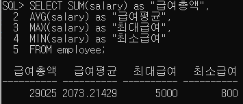
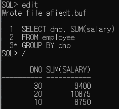
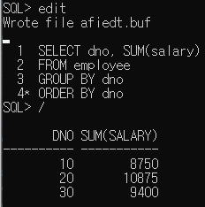
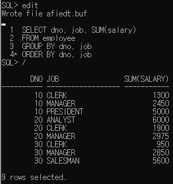
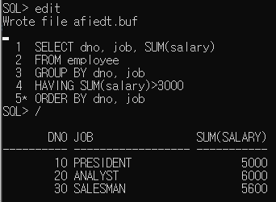
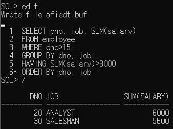

학습 일자 : 2022.05.10
학습 목표

1. 그룹함수 이해
2. GROUP BY 이해
3. HAVING 이해

---

## 그룹함수

테이블의 전체 데이터에서 통계적인 결과를 구하기 위해서 행 집합에 적용하여 하나의 결과를 생산
하나의 결과를 생산하므로 결과가 여러 행인 컬럼과 같이 SELECT 할 수 없음

| 구분  | 설명                    |
| ----- | ----------------------- |
| SUM   | 그룹의 누적 합계를 반환 |
| AVG   | 그룹의 평균을 반환      |
| COUNT | 그룹의 총 개수를 반환   |
| MAX   | 그룹의 최대값을 반환    |
| MIN   | 그룹의 최소값을 반환    |



  
_NULL 데이터는 제외하고 합계를 구함_

---

## GROUP BY

특정 칼럼을 기준으로 그룹별로 나눌 때 사용

```sql
SELECT 칼럼명, 그룹함수
FROM 테이블명
WHERE 조건 (연산자)
GROUP BY 칼럼명;
```

- 부서번호별로 그룹을 나눔
  

- 부서번호를 오름차순으로 정렬
  

- 각 부서의 직책별 합계급여
  
  _GROUP BY 절에 명시하는 열을 여러 개 지정할 수 있음_
  _먼저 지정한 열로 대그룹을 나누고 그 다음 지정한 열로 소그룹을 나눔_

※ 다중행 함수를 사용하지 않은 일반 열은 GROUP BY 절에 명시하지 않으면 SELECT절에서 사용할 수 없음  
즉, GROUP BY절을 사용한 그룹화는 그룹화된 열 외에 일반 열을 SELECT절에 명시할 수 없음

---

## HAVING절

- HAVING절은 SELECT문에 GROUP BY절이 존재할 때만 사용할 수 있음
- GROUP BY절을 통해 그룹화된 결과 값의 범위를 제한하는데 사용
- WHERE절은 출력 대상 행을 제한하고, HAVING절은 그룹화된 대상을 출력에서 제한하므로 쓰임새는 전혀 다름

출력 예시

- 월급 합계가 3000이상인 결과값 출력 조건 추가(HAVING)
  

- 부서번호가 15이상인 결과값 출력 조건 추가(WHERE)
  
