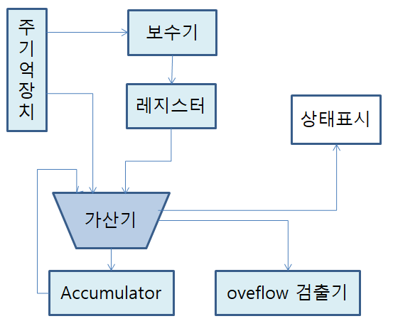

# Computer System

## 컴퓨터 시스템 구성

### Computer

`응용소프트웨어 + 시스템소프트웨어 + 하드웨어`

### Hardware

`중앙처리장치 + 기억장치(주기억장치, 보조기억장치) + 입출력장치 + 전원공급장치, 냉각 송풍기`

### Software

`시스템소프트웨어(운영체제, 언어 번역 프로그램) + 응용소프트웨어(패키지 프로그램, 사용자 개발 프로그램)`

_주기억장치: RAM, ROM_  
_보조기억장치: 하드디스크, CD-ROM_

---

## Computer Architecture

컴퓨터 시스템은 **입력, 제어, 연산, 기억, 출력** 장치로 이루어지는데 이러한 기능 블록별 연결 조직을 `Computer Architecture`라고 한다.

</img>

---

## BUS

CPU와 시스템 내의 다른 요소들 사이에 정보를 교환하는 통로가 되는 것을 `시스템 버스`라고 한다.

이 버스의 주요 목적은 `CPU내부와 외부를 접속`하는 것이다.

종류로는 데이터버스, 주소버스, 제어버스가 있다.

_주소버스: 단방향_  
_데이터버스와 제어버스: 양방향_

---

## ALU

Accumulator: 누산기, 연산의 중심이 되는 레지스터, `연산결과를 일시적으로 저장`한다.

범용 레지스터: 연산결과 임시 저장, 어드레스 인덱싱목적, 주로 `고정 소수점 연산`에 사용된다.

부동소수점 레지스터: `실수의 데이터를 저장`한다.

상태 레지스터: 산술, 연산 결과로 발생된 carry, zero, overflow등 `CPU상태를 저장`한다.

시프트 레지스터: `수치데이터를 이동`시킨다.

스택포인터: `스택의 현 위치`를 지시한다.

</img>

---

※자료출처: https://blog.naver.com/ionebabo/221517880826
