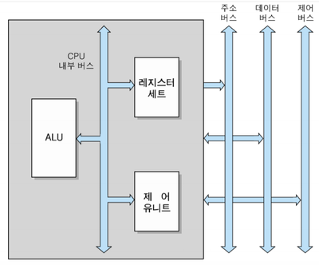

# CPU구조와 기능

컴퓨터의 5대 기능 중에서 제어 및 연산을 실행하는 장치가 CPU다.  
이 CPU의 구성요소를 세분화하면 `ALU(연산장치), 범용레지스터, 특수 레지스터, 제어장치와 내부 버스로 구성`된다.

---

## CPU의 기본 구조

</img>  
CPU는 `ALU와 레지스터 및 제어장치로 구성`된다.

1. ### ALU

   i. 2진의 가감산  
   ii. 논리 연산(bool)  
   iii. 보수 연산  
   iv. 시프트 연산  
   위의 기능들이 있다.

   ALU의 기본 원리는 `ALU안에 여러 논리기능을 가진 장치들(시프터, 보수기, 가산기)가 있는데 Select Signal에 의해 처리`하도록 한다.

2. ### 레지스터

   CPU내부에 있는 소규모의 일시적인 기억장치로 주기억장치처럼 `어드레스로 지정될 수 없고 2진 Cell로 구성`되어 있다.  
    데이터는 프로그램 진행 중 데이터가 요구될 때, 버스나 다른 장치가 데이터를 받을 준비가 될 때까지 레지스터에 보관된다.  
   | 레지스터 종류 | 기능 |
   |---|---|
   | 누산기 | 1-주소 명령어를 스는 시스템에서 연산의 중심이 되는 레지스터, 연산 결과 임시 저장 |
   | 범용 레지스터 <br>(General Register) | 산술/논리/연산 결과 임시 저장, 색인 등 여러 목적으로 사용 |
   | Program Counter (PC) | 다음번에 수행될 명령어가 들어있는 번지를 지시하는 레지스터 |
   | Instruction Register (IR) | 실행될 명령어를 임시 보존하는 레지스터 |
   | Memory Address Register (MAR) | CPU에 저장된 명령어 주소가 시스템 버스로 출력되기 전에 일시적으로 저장되는 주소레지스터 PC가 가리키는 내용이 옮겨진다. |
   | Memory Buffer Register (MBR) | MAR이 지시하는 번지의 내용(명령어,데이터)를 일시 보존하는 레지스터 여기 들어온 명령어는 IR로 가고 데이터는 명령에 따라 다른곳으로 간다. |

3. ### 제어장치

   명령어를 해석하고 실행하기 위한 `제어신호들을 순서대로 발생시키는 하드웨어 모듈`

---

## 명령어 사이클

CPU는 기억장치에 저장되어 있는 명령어들을 인출 실행하여 실제 작업을 수행한다.  
`한 개의 명령어를 실행하는 데 필요한 전체 처리 과정`을 명령어 사이클이라고 한다.

1.  ### Fetch Cycle

    CPU는 각 명령어 사이클이 시작할 때, `PC가 가리키는 기억장치의 위치로부터 명령어를 가져온다.`  
    그다음 PC의 내용을 1증가해 명령어를 순서대로 읽을 수 있게 한다.

    ex)  
     현재 PC : 210  
     -> 210번지에 있는 명령어를 FETCH  
     -> PC : 211(증가)

    ```c
    MAR <- PC //PC에 저장된 내용을 MAR로
    MBR <- M[MAR], PC <- PC + 1 //MAR번지에 있는 내용인 명령어를 MBR에 저장하고 PC증가
    IR <- MBR //명령어를 IR로 전송
    ```

2.  ### Indirect Cycle

    연산에 필요한 실제 피연산자를 읽어와야 한다. 오퍼랜드 필드에 있는 주소 A에 저장 된 값이 실제피연산자가 아닌 유효주소라면 A를 간접주소라고 한다.  
    간접사이클은 `오퍼랜드필드에 포함된 간접주소로부터 실제 피연산자가 저장된 위치를 가리키는 유효주소를 읽어들이는 과정`이다.

    ```c
    MAR <- IR(오퍼랜드) //오퍼랜드 필드의 간접번지를 MAR로 전송
    MBR <- M[MAR] //MAR번지의 내용인 유효주소를 MBR로 전송
    IR <- MBR //MBR의 내용을 IR에 저장, 이렇게 되면 새로운 오퍼랜드 필드에는 실제 피연산자를 기리키는 주소가 준비
    ```

3.  ### Execution Cycle

    `CPU가 FETCH된 명령어 코드를 해독하고 결과에 따라 필요한 연산을 수행한다.`  
     연산에 사용될 피연산자를 직접 가리키는 주소가 오퍼랜드필드에 들어있다고 가정하고 CPU에서 동작하는 몇 가지 명령어 실행 사이클을 설계한다.

    - LOAD

      오퍼랜드 필드에 포함된 기억장치 번지 내용을 AC에 로드

      ```c
      MAR <- IR(오퍼랜드)
      MBR <- M[MAR]
      AC <- MBR
      ```

    - STORE

      AC의 내용을 오퍼랜드 필드에 포함된 기억장치 번지에 저장

      ```c
      MAR <- IR(오퍼랜드)
      MBR <- AC
      M[MAR] <- MBR
      ```

    - SUM

      AC의 내용과 오퍼랜드 필드에 포함된 번지의 내용을 더해 저장

      ```c
      MAR <- IR(오퍼랜드)
      MBR <- M[MAR]
      AC <- AC + MBR
      ```

    - JUMP

      프로그램의 흐름이 오퍼랜드 필드에 포함된 번지로 분기

      ```c
      PC <- IR(오퍼랜드)
      ```

4.  ### Interrupt Cycle

    인터럽트 서비스 루틴의 시작번지를 호출해 실행을 준비하는 단계, 이 루틴은 기억장치에 저장되어 있고 할 일이 미리 정해져있다.  
    인터럽트는 `프로그램의 정상적인 순서를 방해하는 서비스 요구`다.  
    S/W 인터럽트는 프로그램의 요청에 의해 발생하고 H/W 인터럽트는 CPU외부장치에서 발생한다.
    인터럽트 요구를 수용하려면 CPU에서 하던 작업을 중단하고 인터럽트를 먼저 처리한다. 그래서 ISR의 시작번지를 PC로 불러 실행한다.

    ```c
    MBR <- PC //현재 PC는 인터럽트 후 돌아올 (복귀)주소가 저장 되어 있다.
    MAR <- SP, PC <- ISR의 시작번지 //현재 스택포인터에 포함된 주소를 MAR로 전송하고 PC를 ISR의 시작번지로 이동한다.
    M[MAR] <- MBR, SP <- SP - 1 // 복귀 주소를 MAR번지 메모리에 저장하고 SP를 감소시켜 다음 번 저장위치를 새로 준비
    ```

---

## 명령어 파이프 라이닝

파이프라인은 하나의 연산을 기능이 서로 다른 여러 개의 명령어들로 나누는 데, `각 명령어는 STAGE라고 하는 회로에서 수행되고 , 이들 STAGE가 하나의 pipeline을 형성하도록 연결`되어 있다. 이러한 기법을 파이프라인이라고 한다.

1.  ### 파이프라인의 효율성

    파이프라인을 갖추지 않은 시스템이서 n개의 명령을 실행하는데 필요한 시간을 n \* tn이라고 하자.  
     파이프라인을 갖춘 시스템에서는 클록시간이 tp고 최초 명령어를 실행하는 데는 k주기가 걸린다면 나머지 (n-1)개의 명령어들은 각각 한 주기씩만 소요된다.
    그래서 n개의 명령어가 최종 주기를 통과하는 데 필요한 시간은 _ktρ + (n - 1)tρ_ 가 되게 된다.

    _CISC VS RISC_

    |              | CISC(Complex Instruction Set Computing)                           | RISC(Reduced Instruction Set Computing)                             |
    | ------------ | ----------------------------------------------------------------- | ------------------------------------------------------------------- |
    | 의미         | 복잡한 명령어 집합으로 각각 명령은 특정한 회로로 구성된다.        | CPU명령어 개수를 줄여 H/W구조를 좀 더 간단하게 설계한 CPU           |
    | 장/단점      | 효율적인 컴파일러와 강력한 os를 개발할 수 있다 (BUT 속도↓, 가격↑) | 시스템 설계를 빠르고 쉽게, 적은 수의 트랜지스터를 사용하여 가격저렴 |
    | 명령어 수    | 100~250                                                           | 최소화                                                              |
    | 길이,형식    | 다양한 길이와 형식                                                | 고정 길이, LOAD/STORE와 레지스터간 연산만 허용                      |
    | 주소지정     | 다양                                                              | 최소화                                                              |
    | 제어장치구성 | 마이크로프로그램                                                  | 고정 배선                                                           |
    | 파이프라인   | 비효율                                                            | 효율                                                                |
    | 캐시메모리   | 반드시는 아님                                                     | 반드시 필요                                                         |

2.  ### 파이프라인 저해 요인

    - 하드웨어 설계  
      묵시적 주소 지정 방식에서는 오퍼랜드를 인출할 필요가 없는 경우가 생긴다. 하지만 파이프라인을 단순화하기 위해 모든 명령어들이 네단계를 통과하도록 해야 해서 필요없는 사이클이 소모 된다.

    - 병목현상  
      어떤 클록 주기의 시간이 다른 클록 주기보다 길다면 병목현상이 일어난다.

    - 자원충돌  
      두 단계가 동시에 같은 자원에 접근할 때 일어난다.

    - 분기 곤란  
      조건에 따라 다른 위치로 분기하도록 하는 BRANCH명령어가 실행되면 미리 인출되어 파이프라인에서 처리되고 있는 명령어들이 무효화 될 수 있다. 이를 막기 위해 다음과 같은 방법이 사용된다.

      _i. Prefetch Branch Target : 분기 명령어 다음의 명령어와 함께 가져온다. 분기가 이루어지지않을 경우 다음 명령어를 실행하고 분기가 이루어지면 미리 가져온 명령어로부터 파이프라인 실행_  
      _ii. Loop Buffer : n개의 명령어가 순서대로 저장되어 있는데 분기 발생시 분기의 목적지 명령어가 버퍼에 있는지 검사한다. 있다면 버퍼로부터 인출된다._  
      _iii. Branch Prediction : 미리 예측하는 확률적인 방법_  
      _iv. Delayed Branch : 대부분의 RISC프로세서가 채용, 컴파일 시 컴파일러가 분기명령을 탐지해 파이프라인이 막힘없이 동작되도록 하는 명령을 삽입_

---

※자료출처: https://blog.naver.com/ionebabo/221517880826
