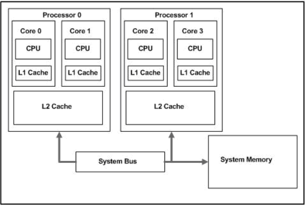

# 주기억장치

## 기억 장치의 분류

### 1. Access방법에 따른 유형

- 순차접근(Sequential Access)  
  자기 테이프 처럼 `처음 위치에서 시작하여 순차적으로 저장`한다.  
  이 내용들은 레코드 단위로 저장되고 각각 고유 주소를 가지나 검색시 원하는 위치에 도달해야 하므로 위치에 따라 접근시간이 달라진다.

- 직접접근(Direct Access)  
  자기디스크와 CD-ROM처럼 `접근할 위치 근처로 이동 후 순차 검색을 통해 최종위치에 도달`한다.

- 임의접근(Random Access)  
  `주소에 의해 직접 기억장소를 찾아 접근`하여 어느 위치던 접근 시간이 동일하다.

- 연관접근(Associative Access)  
   임의접근의 변형으로 `저장된 내용의 특정 비트를 비교하여 일치하는 내용을 접근`한다.  
  논리주소에서 생성된 키 값에 연관되는 비트들과 변위 값이 일치하는 기억장소의 데이터가 출력된다.

### 2. 기억장치의 제조 재료에 따른 유형

- 반도체 기억장치  
  `실리콘 칩`을 이용하여 부피가 작고 처리시간이 매우 빠르지만 열에 약하다.  
  반도체 재료로 만든 기억 회로들을 플립플롭 회로라고 하는데 이 회로들은 0과 1을 기억하는 회로들이고 자기 코어 한 개와 같은 역할을 한다.

- 자기 표면 장치  
  `알루미늄 원판 표면`에 자성물질을 입힌 보조기억장치다.  
  자기 디스크(=하드디스크)는 액세스 시간이 짧고 대량 정보를 기억할 수 있다는 특징이 있다.

### 3. 데이터를 저장하는 성질에 따른 유형

- 휘발성 기억장치  
  `RAM(Random Access Memory)이라고 하며 전원 공급이 중단되면 내용이 지워진다.`  
  임의 접근 방식을 사용하는 반도체 직접회로 이고 지워지기 때문에 소멸성 반도체라고도 한다.  
  제조기술에 따라 DRAM, SRAM으로 나누어 지고 DRAM은 대용량 주기억장치로 많이 이용되고 SRAM은 높은 속도가 필요한 캐쉬메모리로 사용된다.

  _DRAM: 커패시터에 전하를 충전하는 방식으로 기억밀도가 높고 저렴하지만 저장된 내용을 주기적으로 재충전해야 한다._  
  _SRAM: 기억소자로서 플립플롭을 이용하여 안정된 상태에서 데이터가 저장되고 전력 공급 시간동안 재충전 없이 데이터를 계속 유지할 수 있다._

- 비휘발성 기억장치  
  `ROM(Read Only Memory)이라고 하며 전원 공급에 관계없는 영구 저장장치이다.`  
  ROM은 읽기만 가능하여 변경할 필요가 없는 데이터를 저장하는데 사용된다.  
  자원을 영구 저장하여 보조기억장치로부터 매번 이동할 필요가 없어 액세스 시간이 짧다.

- 반도체 메모리  
  주기억장치는 `메모리셀이라고 하는 기본 단위의 기억 소자를 여러 개 모아 놓은 것으로 각 메모리셀은 1비트의 정보를 저장할 수 있는 플립플롭 회로로 구성`되어 있다.  
  일반적으로 반도체 메모리는 거의 플립플롭의 2차원적 집합이다. 즉 기억장치의 구성은 Memory Cell들이 다수가 모여서 이루어진다.  
  기억장치 중 Memory Part는 2차원 행렬로 구성되고 어드레스 신호의 상위부와 하위부에서 지정되어 양쪽의 어드레스 신호가 일치한 메모리 셀이 선택되며 메모리 셀의 선택은 디코더에 의해 이루어진다.

  _기억장치의 계층 구조: 접근 속도가 빠를수록 좋으므로 자주 사용하지 않는 자료들은 CPU에서 멀리 저장되고 자주 사용하는 것은 가까이에 저장_

---

## 캐시 메모리

주로 `CPU와 주기억장치 사이에 사용하는 빠른 속도의 메모리`다.  
컴퓨터가 작업에 주로 사용하는 **메인메모리의 액세스타임을 줄이기 위한 목적**으로 사용한다.  
만약 멀티코어 캐시라면 L1, L2는 각 코어가 독점하고 L3캐시로 일관성을 유지하게 해준다.  
속도는 L1으로 갈수록 빨라지며 CPU는 상위 캐시부터 찾고 없으면 하위계층으로 내려가며 정보를 찾는다.

</img>

---

## 이중독립버스 구조

메모리는 이중독립버스 구조가 있다.  
`CPU와 메인메모리사이의 시스템버스`, `CPU코어와 캐시메모리사이의 캐시 버스`가 독립적인 버스를 갖는 구조다.  
이러한 구조로 메모리 버스의 한계를 극복할 수 있고 단일버스 방식보다 **최대 3배까지 전송속도를 개선**할 수 있다.

---

## 캐시 액세스 타임

`캐시의 목적은 평균 액세스타임을 줄이는 것`이다.  
시스템의 성능을 높이기 위해 메모리 상위계층에 데이터가 존재할 확률을 높여야 한다.

_평균 액세스타임 계산 방법_  
_T = H * Tc + (1-H) * Tm_  
_(H: 캐시적중률, Tc: 캐시메모리접근시간, Tm: 주기억장치 액세스시간)_

---

## 쓰기 정책(Write Policy)

Write Through  
`CPU가 캐시 메모리와 주기억장치 두 곳의 데이터를 함께 갱신한다.`  
캐시가 먼저 업데이트되고 잠시 후 주기억장치에 기록이 완료된다.  
이 방식은 매번 주기억장치를 업데이트해야 해서 쓰기 시간이 오래걸린다.

Write Back  
`캐시에서 데이터가 변경되도 주기억장치는 갱신되지 않는다.`  
기억장치에 대한 쓰기 횟수가 최소화 되어 쓰기 시간이 짧아진다. 하지만 주 기억장치의 일부 블록들이 새로운 내용으로 갱신할 때까지 무효 상태에 있게 된다. 그래서 데이터 교체나 I/O장치에 대한 주기억장치 접근시 캐시의 상태를 확인해서 갱신해야 한다. 또한 캐시 슬롯이 상태 비트를 가지고 있어야 한다.

---

※자료출처: https://blog.naver.com/ionebabo/221517880826
