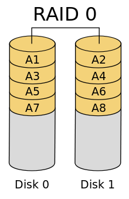
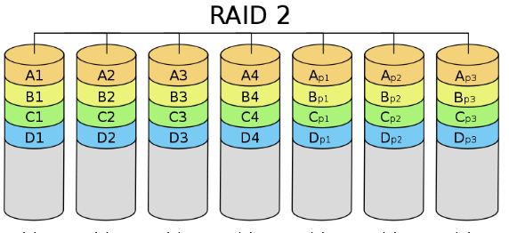
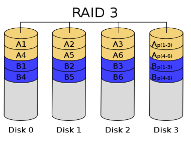
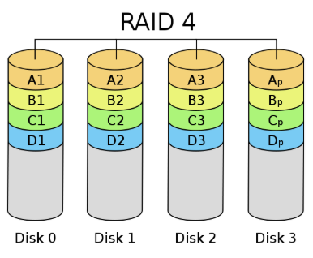
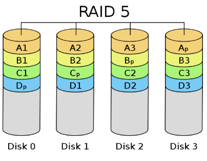

# 보조기억장치

## 자기디스크(하드디스크)

순차접근  
랜덤접근

`디스크 드라이버와 이동이 가능한 디스크 팩으로 이루어져 있다.`  
한 면의 디스크 위에는 200여개의 동심원이 있고 여기에 데이터가 기록되는데 이 동심원을 트랙이라고 한다.  
각 디스크사이에는 Access Arm이 있으며 각 트랙은 여러 개의 섹터들로 분리 되어 있다.  
디스크의 중심축으로부터 동일한 거리에 위치하고 있는 트랙의 모임을 실린더라고 한다.

---

## RAID

프로그램 처리 속도는 계속 성장했으나 디스크의 성능은 그와 보조를 맞추지 못했는데 이때 등장한것이 RAID(Redundant Array of Inexpensive Disks)다.  
`여러 개의 작은 디스크들을 배열 구조로 연결하고 하나의 유닛으로 패키지`하여 **액세스속도를 크게 향상시키고 신뢰도를 높였다.**  
이렇게 용량을 늘리기 위해 배열 구조로 분산 저장하면 이 디스크들에 `동시 액세스 하는 것이 가능`해진다.  
디스크마다 별도의 전송 채널로 접속하면 병렬 전송이 가능해지는데 이 기술이 디스크 인터리빙이다.  
RAID구조의 주요 단점은 평균 고장 수명이 줄어 고장 날 확률이 증가한다.

_ex) 4년 마다 1번 고장나는 디스크를 4개를 연결하면 확률이 증가해 1년마다 고장나게 된다._  
_MTTF(디스크하나의MTTF/배열 디스크의 수)를 고장이 발생하는 기간의 평균값이라고 한다._

---

- ### RAID0

  `패리티가 없는 스트라이핑 세트(적어도 2개의 DISK)`를 사용한다.  
  개선된 성능에 추기적인 기억 장치를 제공하지만 실패할 경우 자료의 안전을 보장할 수 없다.  
  오류를 검출할 수 없어 복구가 불가능하여 디스크 실패시 배열을 파괴하는데 디스크를 많이 장착할 수록 가능성이 더 크다.  
  배열에 디스크를 많이 넣을 수록 높은 대역을 사용할 수 있지만 데이터 손실의 위험을 가진다.

  </img>  
  _디스크 스트라이핑 데이터를 여러 개의 디스크에 똑같은 크기의 스트라이프 단위로 나누어 분산 저장_

---

- ### RAID1

  `한 개 이상의 디스크에 데이터를 중복해 저장하고 데이터를 분산하지 않으며` 디스크 미러링이라고도 한다.  
  속도가 다른 두 개의 디스크를 묶어 액세스 속도가 빠른 쪽의 디스크에서 읽는다. 하지만 쓰기 동작시 두 디스크의 헤더가 다르다면 한 디스크가 늦게 쓰여질 수 있다. 이때는 늦게 쓰여진 디스크 동작이 완료되야 쓰기가 끝난다.  
  구조는 간단하지만 용량이 크게 줄고 비용이 많이 든다. 그렇지만 중복저장하므로 높은 신뢰도를 요구하는 시스템에서 사용된다.

  </img>

---

- ### RAID2

  `디스크에 데이터를 비트단위로 분산 저장한다.`  
  오류 검출 및 정정이 가능하도록 해밍코드로 여분의 패리티 비트를 계산 해 여러 개의 검사디스크에 저장한다. 디스크 배열 수 가 증가할수록 전체 디스크 중 검사 디스크의 비율은 줄어든다.  
  오류가 많이 발생하는 환경에서는 효과적이지만 가격이 높아 거의 사용하지 않는다.

  </img>

---

- ### RAID3

  `각 디스크에 데이터를 바이트 단위로 분산 저장하고 패리티 바이트를 저장할 하나의 검사 디스크만 사용한다.`  
  이 방법을 이용하면 어떤 데잍터 디스크에 결함이 발생해도 다른 디스크들의 데이터를 이용하여 결함 디스크의 데이터를 복구할 수 있다.  
  RAID2방식에 비해 패리티 디스크가 줄어들었지만 기록할 때마다 패리티바이트를 계산해 검사디스크에 넣어야 해서 패리티를 사용하지 않을 때보다 성능이 감소한다.

  </img>

---

- ### RAID4

  `바이트들의 묶음인 블록 단위로 분산 저장하고 패리티정보도 하나의 검사 디스크에 블록단위로 저장한다.` RAID3와 단위만 빼고 일치한다.

  </img>

---

- ### RAID5

  RAID3와 RAID4는 전용 패리티 디스크를 사용하기 때문에 데이터 디스크에 기록할 때마다 패리티 디스크를 갱신해야 한다. 이때 패리티 디스크에 액세스가 집중되는 병목 현상으로 여러 개의 데이터 디스크에 동시 쓰기가 불가능해져 성능이 저하된다.  
  그래서 `패리티 블록을 여러 개의 디스크에 분산 저장하는 방식을 사용한다.` 이렇게 해서 디스크의 병목현상을 없앤다.

  </img>

---

※자료출처: https://blog.naver.com/ionebabo/221517880826
