학습 일자 : 2022.04.28
학습 목표

1. 문자형의 값을 조작하여 변환된 문자 값을 반환하는 문자 함수 학습
2. 숫자형 데이터를 조작하여 변환된 숫자 값을 반환하는 숫자 함수 학습
3. DATE(날짜)형을 사용하여 결과 값으로 날짜 또는 기간을 얻는 날짜 함수 학습

---

### 문자 처리 함수

| 구분       | 설명                                                         |
| ---------- | ------------------------------------------------------------ |
| CONCAT     | 문자의 값을 연결                                             |
| SUBSTR     | 문자를 잘라 추출 (한글 1byte)                                |
| SUBSTRB    | 문자를 잘라 추출 (한글 3byte)                                |
| INSTR      | 특정 문자의 위치 값을 반환 (한글 1byte)                      |
| INSTRB     | 특정 문자의 위치 값을 반환 (한글 3byte)                      |
| LPAD, RPAD | 입력 받은 문자열과 기호를 정렬하여 특정 길이의 문자열로 반환 |
| TRIM       | 잘라내고 남은 문자를 표시                                    |

- 문자열 내에 해당 문자가 어느 위치에 존재하는지 찾기

  ```sql
  SELECT instr(대상 문자열, 찾을 글자, 시작 위치, 몇 번째 발견)
  FROM dual;
  ```

  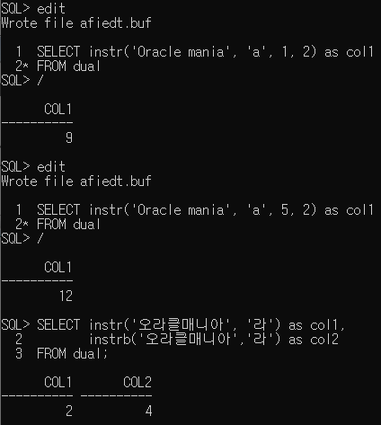

  응용) 이름의 세번째 자리가 R인 사원 구하기  
  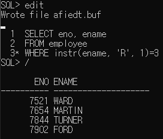

- 위조 방지를 위해 입력받은 문자열의 남은 자리를 기호로 채우기  
  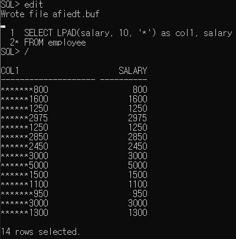

- 문자열 앞뒤에 공백을 제거하기  
  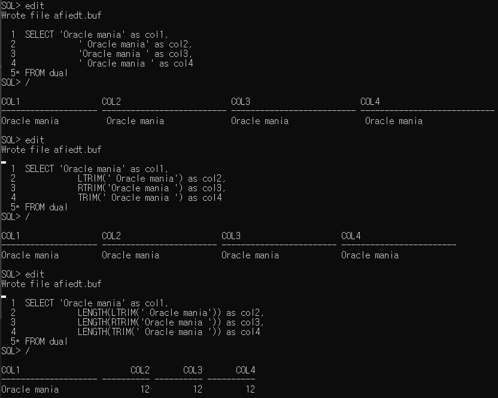

---

### 숫자 처리 함수

| 구분  | 설명                                 |
| ----- | ------------------------------------ |
| ROUND | 특정 자릿수에서 반올림               |
| TRUNC | 특정 자릿수에서 버림                 |
| MOD   | 입력 받은 수를 나눈 나머지 값을 반환 |

- 특정 자릿수에서 반올림  
  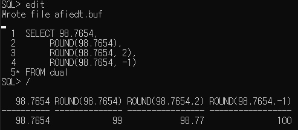

- 특정 자릿수에서 버림  
  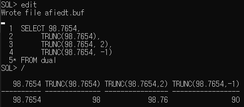

- 숫자를 나머지 연산하기  
  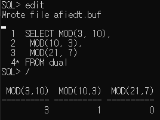

---

### 날짜 처리 함수

| 구분           | 설명                                                       |
| -------------- | ---------------------------------------------------------- |
| SYSDATE        | 시스템에 저장된 현재 날자를 반환                           |
| MONTHS_BETWEEN | 두 날짜 사이가 몇 개월인지를 반환                          |
| ADD_MONTHS     | 특정 날짜에 개월 수를 더함                                 |
| NEXT_DAY       | 특정 날짜에서 최초로 도래하는 인자로 받은 요일의 날짜 반환 |
| LAST_DAY       | 해당 달의 마지막 날짜를 반환                               |
| ROUND          | 인자로 받은 날짜를 특정 기준으로 반올림                    |
| TRUNC          | 인자로 받은 날짜를 특정 기준으로 버림                      |

- 날짜 연산하기  
  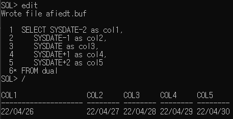

- 날짜 반올림하기  
  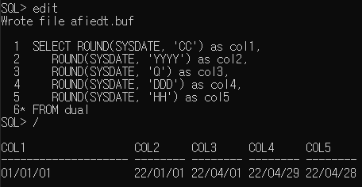  
  _15일을 기준으로 반올림한다_
  _숫자함수의 ROUND를 오버라이딩하여 날짜에도 적용된다_

- 날짜 버림하기  
  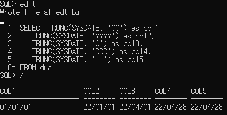

- 날짜 반올림, 버림 기준 포멧
  | 포멧 모델 | 기준 단위 |
  | -------------- | ---------------------------------------------------------- |
  | CC, SCC | 네 자리 연도의 끝 두자리를 기준으로 사용 (2016년이면 2050이하 이므로, 반올림할 경우 2001년으로 처리) |
  | SYYYY, YYYY, YEAR, SYEAR, YYY, YY, Y | 날짜 데이터의 해당 연·월·일의 7월 1일을 기준 (2016년 7월 1일 일 경우, 2017년으로 처리) |
  | IYYY, IYY, IY, I | ISO 8601에서 제정한 날짜 기준년도 포맷을 기준 |
  | Q | 각 분기의 두 번째 달의 16일 기준 |
  | MONTH, MON, MM, RM | 각 달의 16일 기준 |
  | WW | 해당 연도의 몇 주(1~53번째 주)를 기준 |
  | IW | ISO 8601에서 제정한 날짜 기준 해당 연도의 주(week)를 기준 |
  | W | 해당 월의 주(1~5번째 주)를 기준 |
  | DDD, DD, J | 해당 일의 정오(12:00:00)를 기준 |
  | DAY, DY, D | 한 주가 시작되는 날짜를 기준 |
  | HH, HH12, HH24 | 해당일의 시간을 기준 |
  | MI | 해당일 시간의 분을 기준 |

- 근무일수 구하기  
  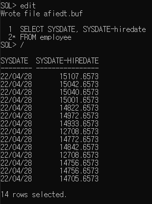  
  _소수점 자리는 시간을 나타내며 하루의 몇%가 지났는지를 의미한다_

- MONTHS_BETWEEN 함수  
  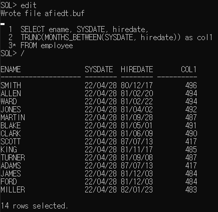

- 오는 토요일 구하기  
  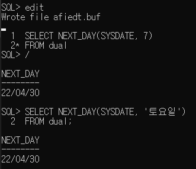

- 입사한 달의 마지막 날 구하기(월말 구하기)  
  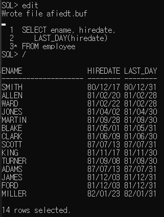

---

### 형 변환 함수

| 구분      | 설명                                 |
| --------- | ------------------------------------ |
| TO_CHAR   | 날짜형 혹은 숫자형을 문자형으로 변환 |
| TO_DATE   | 문자형을 날짜형으로 변환             |
| TO_NUMBER | 문자형을 숫자형으로 변환             |

- TO_CHAR(날짜 데이터, 'format')
  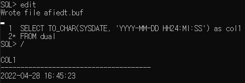

  응용) 입사한날의 요일을 구하기  
  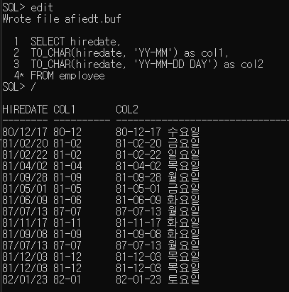

- 응용) 내가 태어난 날의 요일을 구하기  
  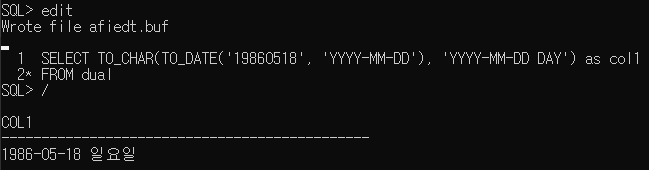

- FORMAT 종류  
  날짜 데이터를 사용할때 FORMAT  
  | 종류 | 의미 |
  | --------- | ------------------------------------ |
  | YYYY | 년도 표현 (4자리) |
  | YY | 년도 표현 (2자리) |
  | MM | 월을 숫자로 표현 |
  | MON | 월을 알파벳으로 표현 |
  | DAY | 요일 표현 |
  | DY | 요일을 약어로 표현 |
  | W | 1년 중 몇 번째 주 (1~53) |

  시간 관련 FORMAT  
  | 종류 | 의미 |
  | --------- | ------------------------------------ |
  | HH24 | 24시간으로 표현한 시간 |
  | HH, HH12 | 12시간으로 표현한 시간 |
  | MI | 분 |
  | SS | 초 |
  | AM, PM, A.M., P.M. | 오전, 오후 표시 |

  숫자 관련 FORMAT  
  | 종류 | 의미 |
  | --------- | ------------------------------------ |
  | 9 | 숫자의 한 자리를 의미함(빈 자리를 채우지 않음) |
  | 0 | 빈 자리를 0으로 채움을 의미함 |
  | $ | 달러($) 표시를 붙여서 출력함 |
  | L | Locale 지역 화폐 단위 기호를 붙여서 출력함 |
  | . | 소수점을 표시함 |
  | , | 천 단위의 구분 기호를 표시함 |

---

### NVL 함수

| 종류  | 의미                                                                                          |
| ----- | --------------------------------------------------------------------------------------------- |
| NVL   | NULL을 0 또는 다른 값으로 변환하기 위해서 사용함                                              |
| NVL2  | 첫 표현식을 검사하여 그 결과가 NULL이 아니면 두 번째 표현식을, NULL이면 세 번째 표현식을 반환 |
| NVLIF | 두 표현식을 비교하여 동일한 경우에는 NULL을 반환, 동일하지 않으면 첫 번째 표현식을 반환       |

- NVL 함수  
  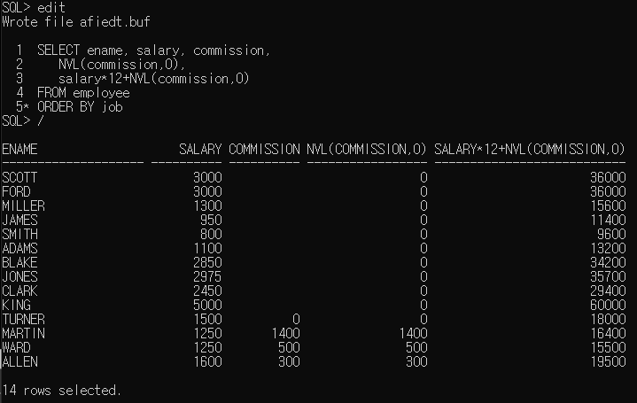

- NVL2 함수  
  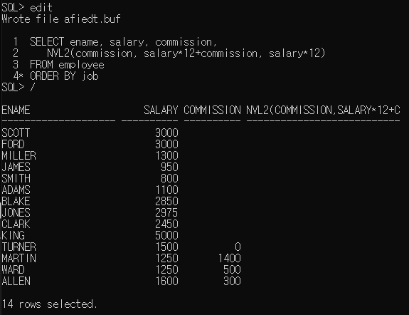

- NVLIF 함수  
  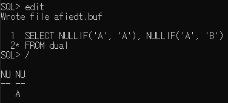

---

### COALESCE 함수

- 가변인자 함수
- 인수 중에서 NULL이 아닌 첫 번재 인수를 반환
- `COALESCE(expr-1, expr-2, expr-3, ... expr-n)`의 형식으로 사용
  _expr-1이 NULL이 아니면 expr-1을 반환_
  _expr-1이 NULL이고 expr-2가 NULL이 아니면 expr-2을 반환_

---

### DECODE 함수

- 가변인자 함수
- 조건에 따라 다양한 선택이 가능
- `DECODE (표현식, 조건1, 결과1, 조건2, 결과2, 조건3, 결과3, 기본결과n)`의 형식으로 사용
- 조건식이 길어서 반드시 별칭 사용(as 별칭)

---

### CASE 함수

- 프로그램 언어의 if, else if, else와 유사한 구조를 갖습니다.
- `CASE 표현식 WHEN 조건1 THEN 결과1 WHEN 조건2 THEN 결과2 WHEN 조건3 THEN 결과3 ELSE 결과n END`의 형식으로 사용
- 조건식이 길어서 반드시 별칭 사용(as 별칭)

---

응용) decode, case 함수 사용하여 직급에 따라 급여인상(ex> salesman 이면 salary+300)
