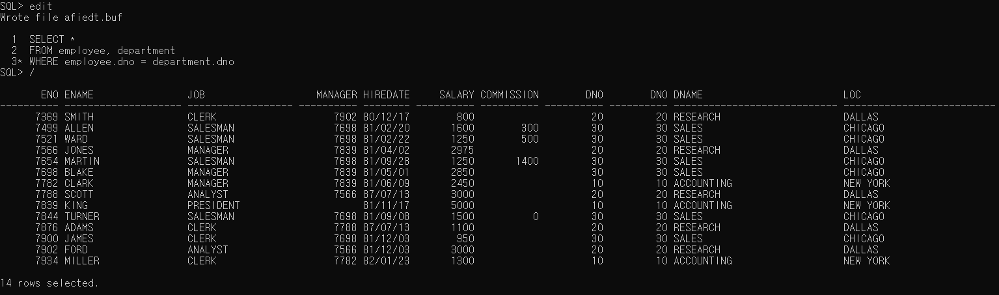
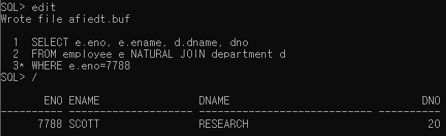
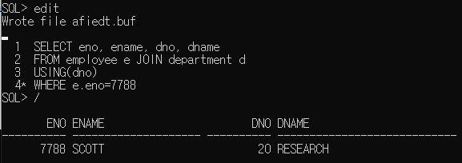
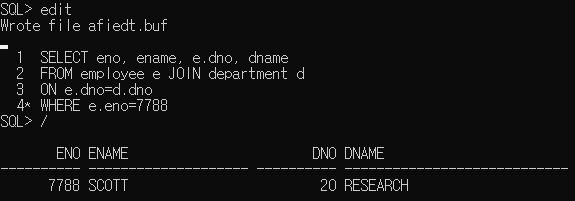
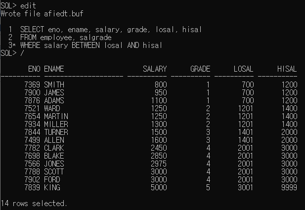
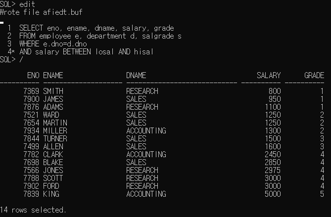
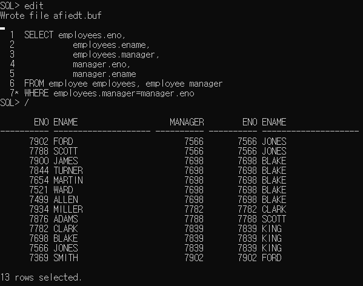
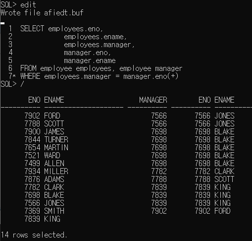

학습 일자 : 2022.05.10
학습 목표

1. EQUI JOIN과 NON EQUI JOIN을 이용하여 여러 테이블의 데이터 액세스 하기
2. SELF JOIN을 이용하여 자신의 테이블과 조인하기
3. ANSI JOIN으로 원하는 데이터를 검색하기

---

## 조인(JOIN)

- 조인은 두 개 이상의 테이블을 연결하여 하나의 테이블처럼 출력할 때 사용하는 방식
- FROM절에는 여러 개 테이블을 지정하는 것이 가능(꼭 테이블이 아니더라도 열과 행으로 구성된 데이터 집합이면 모두 지정 가능)
- FROM절에 여러 테이블을 명시할 때 쉼표(,)를 구분자로 사용하여 지정
- WHERE, GROUP BY, ORDER BY절 등 다른 절도 그대로 사용 가능
- 열 앞에 테이블 이름을 명시하여 특정 열이 어느 테이블에 속한 열인지 구별해야 함(테이블 이름.열 이름)
- FROM절에 지정한 테이블에는 SELECT절의 열에 사용한 것처럼 별칭을 지정할 수 있음(테이블 이름에서 한칸 띄우고 별칭지정)

### EQUI JOIN

- 부서번호 기준으로 두 테이블을 JOIN
  

- 테이블 별칭을 사용
  

### EQUI JOIN-NATURAL JOIN(ANSI 표준)

NATURAL JOIN 키워드를 사용하면 오라클에서 자동적으로 테이블의 모든 칼럼을 대상으로 일치하는 데이터 유형 및 이름을 가진 공통 칼럼을 조사한 후에 자동으로 조인을 수행

```sql
SELECT table1.column, table2.column
FROM table1 NATURAL JOIN table2;
```



### EQUI JOIN-JOIN ~ USING(ANSI 표준)

USING절에 조인 대상이 되는 칼럼을 지정

```sql
SELECT table1.column, table2.column
FROM table1 JOIN table2
USING(column);
```



_JOIN 앞에 INNER 가 생략되어 있음_

### EQUI JOIN-JOIN ~ ON(ANSI 표준)

임의의 조건을 지정하거나 조인할 칼럼을 지정하려면 ON절을 사용

```sql
SELECT table1.column, table2.column
FROM table1 JOIN table2
ON table1.column = table2.column;
```



### NON EQUI JOIN

WHERE절에 '<', BETWEEN a AND b와 같이 '=' 조건이 아닌 연산자를 사용



### TRIPLE TABLE JOIN



### SELF JOIN

하나의 테이블에 있는 칼럼끼리 연결해야 하는 조인이 필요한 경우 사용



### OUTER JOIN

EQUI JOIN에서 양측 칼럼 값 중의 하나가 NULL이지만 조인 결과로 출력할 필요가 있는 경우에 OUTER JOIN을 사용

```sql
SELECT table1.column, table2.column
FROM table1, table2
WHERE table1.column(+) = table2.column;
또는
table1.column = table2.column(+);
```



ANSI 표준으로 바꾸면 아래와 같음

.PNG>)
