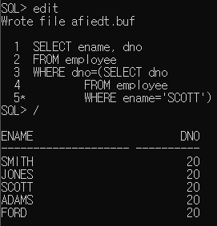
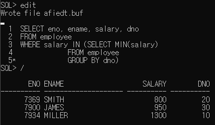
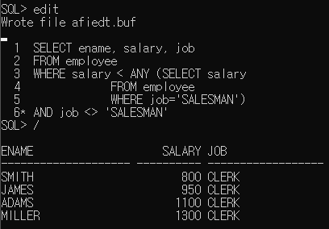
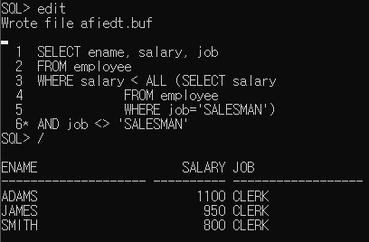
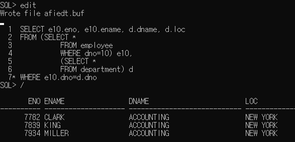
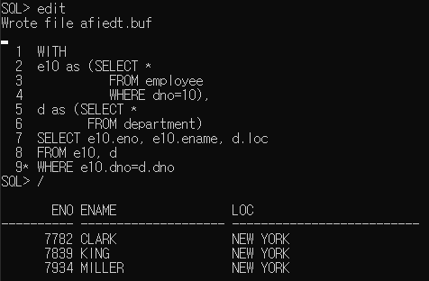

학습 일자 : 2022.05.12
학습 목표

1. 서브 쿼리를 이용해서 원하는 데이터를 검색하기
2. 단일 행 서브 쿼리와 다중 행 서브 쿼리의 차이점 학습

---

## 서브 쿼리의 기본 개념

### 서브 쿼리의 형식

```sql
SELECT select_list
FROM table
WHERE expr operator
      (SELECT select_list
       FROM table
       WHERE .....);
```

### 단일 행 서브 쿼리

- 내부 쿼리문의 결과로 얻어지는 행(row)가 한 개
- 단일 행 비교 연산자(>, =, >=, <, <>, <=)와 함께 사용

예제) SCOTT와 동일한 부서에서 근무하는 사원 출력


### 다중 행 서브 쿼리

- 내부 쿼리문의 결과로 얻어지는 로우가 여러 개
- 다중 행 비교 연산자(IN, ANY, SOM, ALL, EXISTS)와 함께 사용
  | 종류 | 의미 |
  |---|---|
  | IN | 메인 쿼리의 비교 조건('=' 연산자로 비교할 경우)이 서브 쿼리의 결과 중에서 하나라도 일치하면 참 |
  | ANY, SOME | 메인 쿼리의 비교 조건이 서브 쿼리의 검색 결과와 하나 이상이 일치하면 참 |
  | ALL | 메인 쿼리의 비교 조건이 서브 쿼리의 검색 결과와 모든 값이 일치하면 참 |
  | EXIST | 메인 쿼리의 비교 조건이 서브 쿼리의 결과 중에서 만족하는 값이 하나라도 존재하면 참 |

예제) 부서별 최소 급여를 받는 사원의 사원번호와 이름을 출력


### ANY 연산자

- ANY 조건은 메인 쿼리의 비교 조건이 서브 쿼리의 검색 결과와 하나 이상만 일치하면 참
- > ANY는 찾아진 값에 대해서 하나라도 크면 참이 되는 셈이됨 그러므로 찾아진 값 중에서 가장 작은 값 즉, 최소값 보다 크면 참이 됨

예제) 직업이 SALESMAN인 사람보다 월급을 적게 받는 사람을 출력


### ALL 연산자

- ALL 조건은 메인 쿼리의 비교 조건이 서브 쿼리의 검색 결과와 모든 값이 일치하면 참
- 찾아진 값에 대해서 AND 연산을 해서 모두 참이면 참이 되는 셈이됨
- > ALL은 "모든 비교값 보다 크냐" 고 묻는 것이 되므로 최대값보다 더 크면 참

예제) 직업이 SALESMAN인 사람보다 월급을 적게 받는 사람을 출력

_ANY때보다 결과값이 더 줄었음_

### FROM절

- FROM절에도 서브쿼리를 사용할 수 있음
- FROM절에 사용되는 서브쿼리는 인라인 뷰(inline view)라고도 부름
- 특정 테이블 전체 데이터가 아닌 SELECT문을 통해 일부 데이터를 먼저 추출해 온 후 별칭을 줄 수 있음



### WITH절

FROM절에 너무 많은 서브쿼리를 지정하면 가독성이나 성능이 떨어질 수 있기 때문에 경우에 따라 WITH절을 사용


