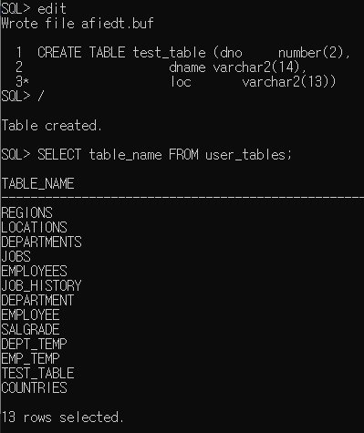
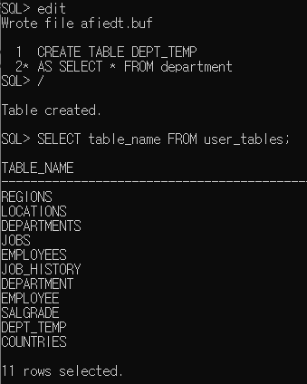
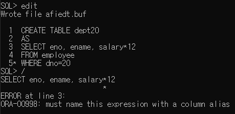
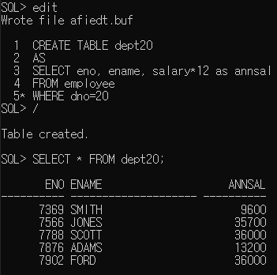
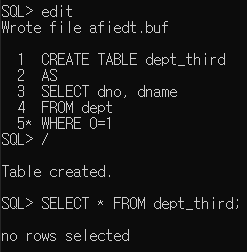
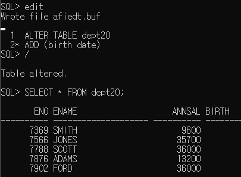
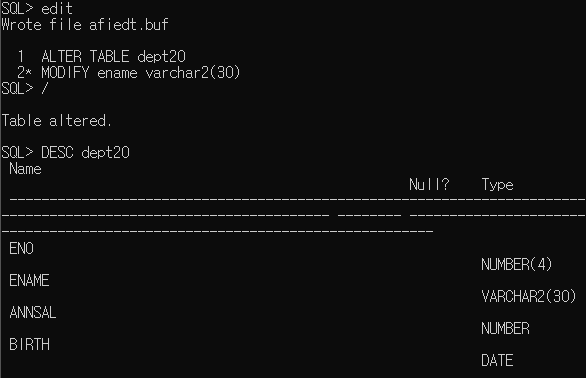

학습 일자 : 2022.05.12
학습 목표

1. 테이블을 생성하기
2. 테이블의 구조를 변경하기
3. 테이블을 제거하거나 이름을 변경하기
4. 테이블에 저장된 모든 데이터를 제거하기

---

## 테이블 구조 생성하기

- DDL(데이터 정의어: Data Definition Language)은 테이블 생성, 수정, 제거하도록 하는 명령문 집합
- CREATE TABLE 문을 통해 데이터를 저장할 테이블을 생성

```sql
CREATE TABLE [schema.] table
      (column datatype [DEFAULT expression]
      [column_constraint clause] [,···]);
```

_schema: 소유자의 이름(사용자 계정)_
_column: 테이블에 포함되는 칼럼명_
_datatype: 칼럼에 대한 데이터 타입과 길이_
_DEFAULT expression: 데이터 입력값이 생략된 경우 입력되는 기본 값_
_column_constraint_clause: 칼럼에 정의되는 무결성 제약 조건_

예제) 각 부서의 부서번호, 부서이름, 위치를 입력할 수 있는 테이블을 생성



- 서브 쿼리를 이용하여 다른 테이블로부터 테이블을 생성하는 것이 가능

```sql
CREATE TABLE table [column [, column ]]
AS subquery;
```



_주의사항: 컬럼명을 명시적으로 언급할 경우 지정한 칼럼 수, 데이터 타입이 SELECT문에 의해 검색된 칼럼과 일치하여야 함, 언급하지 않을 경우 서브 쿼리의 칼럼명이 그대로 적용됨_



_주의사항: 칼럼에 연산을 하여 생성하는 경우 별칭을 지정해줘야함_



- 조건(0=1)이 항상 false이면 테이블안의 내용을 가지고 오지 않음



## 테이블 구조 변경하기

- ALTER TABLE 문을 사용하여 칼럼을 추가, 수정 또는 삭제할 수 있음
- ALTER TABLE ··· ADD 구문을 사용하여 새로운 칼럼을 추가

```sql
ALTER TABLE table_name
ADD ([column_name date_type DEFAULT expr]
     [, column_name data_type] ··· );
```

예제) 사원 테이블에 date타입을 가지는 birth라는 칼럼을 추가



- ALTER TABLE ··· MODIFY 구문을 사용하여 칼럼의 데이터 타입, 크기, 기본값을 변경할 수 있음

```sql
ALTER TABLE table_name
MODIFY ([column_name data_type DEFAULT expr]
        [, column_name data_type] ··· );
```

_기존 칼럼에 데이터가 없는 경우에는 칼럼 타입이나 크기 변경이 자유롭지만, 데이터가 존재하는 경우 타입 변경은 CHAR, VARCHAR2만 허용되며 변경한 칼럼의 크기는 저장된 데이터의 크기와 같거나 클 경우에만 변경 가능하고 숫자 타입은 폭 호은 전체 자릿수를 늘릴 수 있음_
_변경 내용은 변경 후 입력되는 데이터부터 적용이 됨_



- ALTER TABLE ··· DROP COLUMN 구문을 사용하여 특정 칼럼과 칼럼 내의 데이터를 제거할 수 있음
- 2개 이상의 칼럼이 존재하는 테이블에서만 가능하며 한 번에 하나의 칼럼만 삭제할 수 있음
- 삭제된 칼럼은 복구할 수 없음

```sql
ALTER TABLE table_name
DROP COLUMN column_name;
```


## 테이블 구조 삭제하기

## 데이터 사전

- 데이터 사전은 사용자와 데이터베이스 자원의 효율적 관리를 위한 다양한 정보를 저장하는 시스템 테이블의 집합
- 사용자가 테이블을 생성하거나 사용자를 변경하는 등의 작업을 할 때 데이터베이스 서버에 의해 자동으로 갱신되는 테이블
- 사용자는 데이터 사전의 내용을 직접 수정하거나 삭제할 수 없고 읽기 전용 뷰 형태로 사용자에게 제공
  | 접두어 | 의미 |
  |---|---|
  | USER\_ | 자신의 계정이 소유한 객체 등에 관한 정보 조회 |
  | ALL\_ | 자신의 계정 소유했거나 권한을 부여 받은 객체 등에 관한 정보 조회 |
  | DBA\_ | 데이터베이스 관리자만 접근 가능한 객체 등의 정보 조회 |
  | V$\_ | 데이터베이스 성능 관련 정보(X$\_XXXX 테이블의 뷰) |
