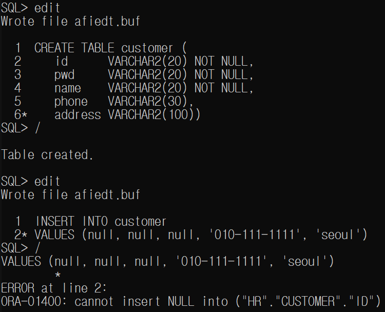
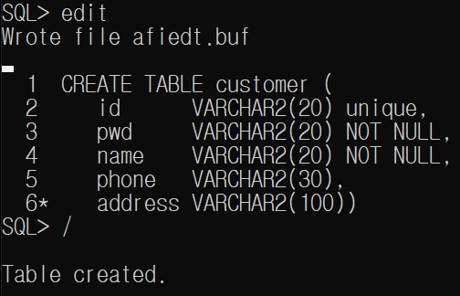
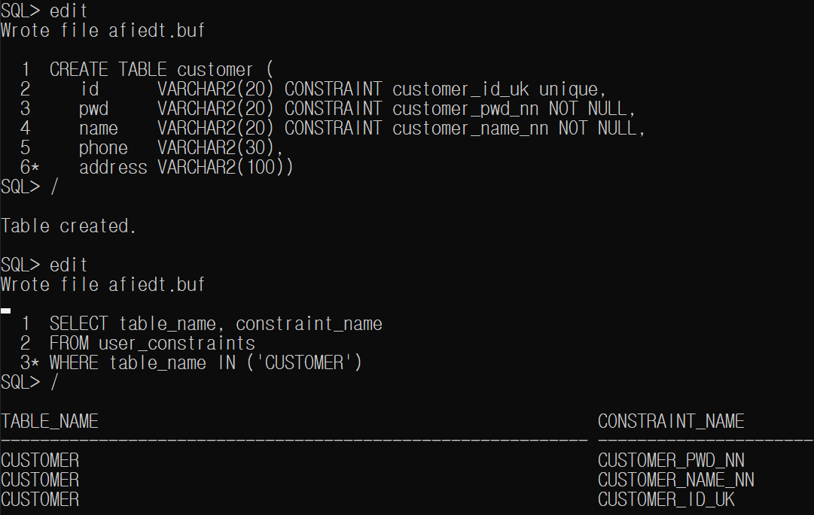
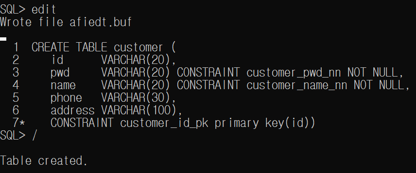

학습 일자 : 2022.05.17
학습 목표

1. 트랜잭션 이해
2. 제약 조건의 종류와 각각의 역할 이해
3. 제약 조건을 생성하고 유지 및 관리 실습

---

- 트랜잭션(Transaction)은 데이터 처리에서 논리적으로 하나의 작업 단위를 의미

- ORACLE 명령어 중 DDL과 DCL은 하나의 명령어가 하나의 트랜잭션이며, DML은 데이터의 변동의 일관성을 위해 하나 이상의 DML문이 모여 하나의 트랜잭션을 구성

- All-OR-Nothing: 여러 개의 명령어 집합이 정상적으로 처리되면 정상 종료하고, 명령어들 중 하나라도 잘못된다면 전체를 취소함

- DML문은 실행됨과 동시에 트랜잭션이 진행되고 DML작업이 성공적으로 처리되었다면 COMMIT을, 취소해야 한다면 ROLLBACK명령을 실행

- COMMIT은 트랜잭션의 처리 과정을 반영하여 변경된 내용을 모두 영구 저장

- ROLLBACK은 트랜잭션의 처리 과정 중 발생한 변경 사항을 취소하는 명령어이고 ROLLBACK을 실행하게 되면 하나의 묶음 처리가 시작되기 이전 상태로 돌아감

---

## 제약 조건

- 제약 조건(Data Integrity Rule)이란 테이블에 유효하지 않은 (부적절한) 데이터가 입력되는 것을 방지하기 위해서 테이블 생성시 각 칼럼에 대해 정의하는 규칙

- ORACLE의 제약 조건 종류
  | 구분 | 설멍 |
  |---|---|
  | NOT NULL | 칼럼에 NULL값을 포함하지 못하도록 지정 |
  | UNIQUE | 테이블의 모든 로우에 대해서 유일한 값을 갖도록 함 |
  | PRIMARY KEY | 테이블의 각 행을 식별하기 위한 것으로 NULL과 중복된 값을 모두 허용하지 않음 즉, NOT NULL 조건과 UNIQUE 조건을 결합한 형태 |
  | FOREIGN KEY | 참조되는 테이블에 칼럼 값이 항상 존재해야 함 |
  | CHECK | 저장 가능한 데이터 값의 범위나 조건을 지정하여 설정한 값만을 허용 |

- 제약 조건은 일반적으로 테이블이 생성 될 때 생성되며, 이후 ALTER TABLE을 이용하여 추가 및 삭제가 가능

```sql
CREATE TABLE [schema.] table
          (column datatype [DEFAULT expression]
          [column_constraint], [table_constraint] [, · · ·]);
```

### NOT NULL 제약 조건

- 제약 조건은 칼럼 레벨과 테이블 레벨로 정의할 수 있음
- 칼럼 레벨에서 정의하는 경우 하나의 칼럼에 대해서 제약 조건을 지정하여 모든 제약 조건을 정의할 수 있음
- 테이블 레벨에서 제약 조건을 정의하는 경우 칼럼 정의와는 별도로 정의하여 NOT NULL을 제외한 모든 제약 조건을 정의할 수 있음



### 유일한 값만 허용하는 UNIQUE 제약 조건

- UNIQUE 제약 조건은 특정 칼럼에 모든 값이 고유하게 유지되도록 하는 고유키를 생성함 즉, 칼럼에 중복된 값을 가질 수 없도록 함
- ORACLE은 고유키에 의해 인덱스를 암시적으로 생성



- 데이터 제약 조건을 보기 위해 USER_CONSTRAINTS 데이터 사전을 사용
- USER_CONS_COLUMNS 데이터 사전은 USER_CONSTRAINTS 데이터 사전으로 알 수 없는 제약 조건이 설정된 칼럼 이름을 알려줌

예제) 제약 조건의 이름을 지정하여 만들고 조회하기



### 데이터 구분을 위한 PRIMARY KEY 제약 조건

- PRIMARY KEY 제약 조건은 테이블에 기본 키를 생성
- 제약 조건이 지정된 칼럼은 중복된 데이터를 저장하지 못하는 고유성이 부여됨
- 기본 키에 속하는 칼럼은 NULL값을 가질 수 없음
- 고유 키 제약 조건과 NOT NULL 제약 조건을 결합한 개념으로 테이블의 모든 로우를 구별하기 위한 식별자를 정의하게 됨



### 참조 무결성을 위한 FOREIGN KEY 제약 조건

- FOREIGN KEY 테이블에 외래 키 제약 조건을 생성
- 참조 무결성은 테이블과 테이블 사이에 주종 관계 설정을 위한 제약 조건
