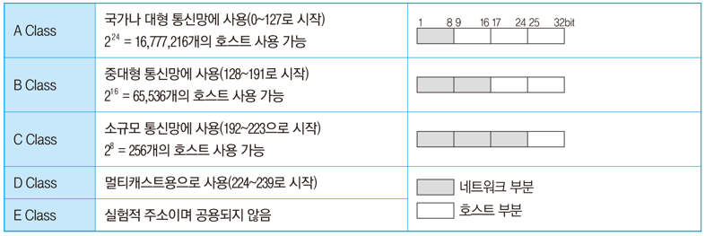

학습 일자 : 2022.05.12

---

### IP주소(Internet Protocol Address)

IP주소는 인터넷에 연결된 모든 컴퓨터 자원을 구분하기 위한 고유한 주소

- 숫자로 8비트씩 4부분, 총 32비트로 구성
- IP주소는 네트워크 부분의 길이에 따라 다음과 같이 A 클래스에서 E 클래스까지 총 5단계로 구성
  

### 서브네팅(Subnetting)

서브네팅은 할당된 네트워크 주소를 다시 여러 개의 작은 네트워크로 나누어 사용하는 것

- 4바이트의 IP주소 중 네트워크 주소와 호스트 주소를 구분하기 위한 비트를 서브넷 마스크(Subnet Mask)라고 하며, 이를 변경하여 네트워크 주소를 여러 개를 분할하여 사용
- 서브넷 마스크는 각 클래스마다 다르게 사용

### IPv6(Internet Protocol version 6)

IPv6은 현재 사용하고 있는 IP주소 체계인 IPv4의 주소 부족 문제를 해결하기 위해 개발됨

- 128비트의 긴 주소를 사용하여 주소 부족 문제를 해결할 수 있으며, IPv4에 비해 자료 전송 속도가 빠름
- 인증성, 기밀성, 데이터 무결성의 지원으로 보안 문제를 해결할 수 있음
- IPv4와 호환성이 뛰어남
- 주소의 확장성, 융퉁성, 연동성이 뛰어나며, 실시간 흐름 제어로 향상된 멀티미디어 기능을 지원
- 패킷 크기를 확장할 수 있으므로 패킷 크기에 제한이 없음

### IPv6의 구성

- 16비트씩 8부분, 총 128로 구성되어 있음
- 각 부분을 16진수로 표현하고, 콜론(:)으로 구분
- IPv6은 다음과 같이 세 가지 주소 체계로 나누어짐
  | | |
  |---|---|
  | 유니캐스트(Unicast) | 단일 송신자와 단일 수신자 간의 통신(1 대 1통신에 사용) |
  | 멀티캐스트(Multicast) | 단일 송신자와 다중 수신자 간의 통신(1 대 다 통신에 사용) |
  | 애니캐스트(Anycast) | 단일 송신자와 가장 가까이 있는 단일 수신자 간의 통신(1 대 1 통신에 사용) |

### 도메인 네임(Domain Name)

도메인 네임은 숫자로 된 IP 주소를 사람이 이해하기 쉬운 문자 형태로 표현한 것

- 호스트 컴퓨터 이름, 소속 기관 이름, 소속 기관의 종류, 소속 국가명 순으로 구성되며, 왼쪽에서 오른쪽으로 갈수록 상위 도메인을 의미

## OSI 참조 모델

- 다른 시스템 간의 원활한 통신을 위해 ISO(국제표준화기구)에서 제안한 통신 규약(Protocol)
- OSI 7계층은 1~3계층을 하위 계층, 4~7계층을 상위 계층이라고 함
  - 하위 계층: 물리 계층 → 데이터 링크 계층 → 네트워크 계층
  - 상위 계층: 전송 계층 → 세션 계층 → 표현 계층 → 응용 계층

### 물리 계층(Physical Layer)

- 전송에 필요한 두 장치 간의 실제 접속과 절단 등 기계적, 전기적, 기능적, 절차적 특성에 대한 규칙을 정의

### 데이터 링크 계층(Data Link Layer)

- 두 개의 인접한 개방 시스템들 간에 신뢰성 있고 효율적인 정보 전송을 할 수 있도록 시스템간 연결 설정과 유지 및 종료를 담당
- 송신측과 수신측의 속도 차이를 해결하기 위한 흐름 제어 기능을 함
- 프레임의 시작과 끝을 구분하기 위한 프레임의 동기화 기능을 함
- 오류의 검출과 회복을 위한 오류 제어 기능을 함

### 네트워크 계층(Network Layer, 망 계층)

- 개방 시스템들 간의 네트워크 연결을 관리하는 기능과 데이터의 교환 및 중계 기능을 함
- 네트워크 연결을 설정, 유지, 해제하는 기능을 함
- 경로 설정(Routing), 데이터 교환 및 중계, 트래픽 제어, 패킷 정보 전송을 수행

### 전송 계층(Transport Layer)

- 논리적 안정과 균일한 데이터 전송 서비스를 제공함으로써 종단 시스템(End-to-End) 간에 투명한 데이터 전송을 가능하게 함
- 종단 시스템(End-to-End)간의 전송 연결 설정, 데이터 전송, 연결 해제 기능을 함
- 주소 설정, 다중화(분할 및 재조립), 오류 제어, 흐름 제어를 수행

### 세션 계층(Session Layer)

- 송·수신 측 간의 관련성을 유지하고 대화 제어를 담당
- 대화(회화) 구성 및 동기 제어, 데이터 교환 관리 기능을 함

### 표현 계층(Presentation Layer)

- 응용 계층으로부터 받은 데이터를 세션 계층에 보내기 전에 통신에 적당한 형태로 변환하고, 세션 계층에서 받은 데이터는 응용 계층에 맞게 변환하는 기능을 함
- 서로 다른 데이터 표현 형태를 갖는 시스템 간의 상호 접속을 위해 필요한 계층
- 코드 변환, 데이터 암호화, 데이터 압축, 구문 검색, 정보 형식(포맷) 변환, 문맥 관리 기능을 함

### 응용 게층(Application Layer)

- 사용자(응용 프로그램)가 OSI 환경에 접근할 수 있도록 서비스를 제공

## 네트워크 관련 장비

### 네트워크 인터페이스 카드(NIC: Network Interface Card)

- 컴퓨터와 컴퓨터 또는 컴퓨터와 네트워크를 연결하는 장치로, 정보 전송 시 정보가 케이블을 통해 전송될 수 있도록 정보 형태를 변경

### 허브(Hub)

- 한 사무실이나 가까운 거리의 컴퓨터들을 연결하는 장치로, 각 회선을 통합적으로 관리하며, 신호 증폭 기능을 하는 리피터의 역할도 포함
- 허브의 종류에는 더미 허브, 스위칭 허브가 있음

### 리피터(Repeater)

- 전송되는 신호가 전송 선로의 특성 및 외부 충격 등의 요인으로 인해 원래의 형태와 다르게 왜곡되거나 약해질 경우 원래의 신호 형태로 재생하여 다시 전송하는 역할을 수행

### 브리지(Bridge)

- LAN과 LAN을 연결하거나 LAN 안에서의 컴퓨터 그룹(세그먼트)을 연결하는 기능을 수행함
- 네트워크를 분산적으로 구성할 수 있어 보안성을 높일 수 있음

### 스위치(Switch)

- 브리지와 같이 LAN과 LAN을 연결하여 훨씬 더 큰 LAN을 만드는 장치
- 하드웨어를 기반으로 처리하므로 전송 속도가 빠름

### 라우터(Router)

- 브리지와 같이 LAN과 LAN의 연결 기능에 데이터 전송의 최적 경로를 선택할 수 있는 기능이 추가된 것으로, 서로 다른 LAN이나 LAN과 WAN의 연결도 수행

### 게이트웨이(Gateway)

- 전 계층(1~7계층)의 프로토콜 구조가 다른 네트워크의 연결을 수행
- LAN에서 다른 네트워크에 데이터를 보내거나 다른 네트워크로부터 데이터를 받아들이는 출입구 역할을 함

## 프로토콜(Protocol)

- 프로토콜은 서로 다른 기기들 간의 데이터 교환을 원활하게 수행할 수 있도록 표준화시켜 놓은 통신 규약
- 프로토콜의 기본 요소
  - 구문(Syntax): 전송하고자 하는 데이터의 형식, 부호화, 신호 레벨 등을 규정
  - 의미(Semantics): 두 기기 간의 효율적이고 정확한 정보 전송을 위한 협조 사항과 오류 관리를 위한 제어 정보를 규정
  - 시간(Timing): 두 기기 간의 통신 속도, 메시지의 순서 제어 등을 규정

### 프로토콜의 기능

- 단편화와 재결합
  - 송신 측에서 전송할 데이터를 전송에 알맞은 일정 크기의 작은 블록으로 자르는 작업을 단편화(Fragmentation)라 하고, 수신 측에서 단편화된 블록을 원래의 데이터로 모으는 것을 재결합(Reassembly)이라 함
- 캡슐화
  - 캡슐화(Encapsulation)는 단편화된 데이터에 송·수신지 주소, 오류 검출 코드, 프로토콜 기능을 구현하기 위한 프로토콜 제어 정보 등의 정보를 부가하는 것으로 요약화라고도 함
- 흐름 제어
  - 흐름 제어(Flow Control)는 수신 측의 처리 능력에 따라 송신 측에서 송신하는 데이터의 전송량이나 전송 속도를 조절하는 기능
  - 정지-대기(Stop-and-Wait), 슬라이딩 윈도우(Sliding Window)방식을 이용
- 오류 제어
  - 오류 제어(Error Control)는 전송중에 발생하는 오류를 검출하고 정정하여 데이터나 제어 정보의 파손에 대비하는 기능
- 동기화
  - 동기화(Synchronization)은 송·수신 측이 같은 상태를 유지하도록 타이밍(Timing)을 맞추는 기능
- 순서 제어
  - 순서 제어(Sequencing)는 전송된는 데이터 블록(PDU)에 전송 순서를 부여하는 기능으로, 연결 위주의 데이터 전송 방식에만 사용됨
- 주소 지정
  - 주소 지정(Addressing)은 데이터가 목적지까지 정확하게 전송될 수 있도록 목적지 이름, 주소, 경로를 부여하는 기능
- 다중화
  - 다중화(Multiplexing)는 한 개의 통신 회선을 여러 가입자들이 동시에 사용하도록 하는 기능
- 경로 제어
  - 경로 제어(Routing)는 송·수신 측 간의 송신 경로 중에서 최적의 패킷 교환 경로를 설정하는 기능
- 전송 서비스
  - 전송하려는 데이터가 사용하도록 하는 별도의 부가 서비스

## TCP/IP

- TCP/IP는 인터넷에 연결된 서로 다른 기종의 컴퓨터들이 데이터를 주고받을 수 있도록 하는 표준 프로토콜임
- TCP/IP는 TCP 프로토콜과 IP 프로토콜이 결합된 것을 의미
- TCP/IP는 응용 계층, 전송 계층, 인터넷 계층, 네트워크 액세스 계층으로 이루어져 있음

### 응용 계층의 주요 프로토콜

- FTP(File Transfer Protocol)
  - 컴퓨터와 컴퓨터 또는 컴퓨터와 인터넷 사이에서 파일을 주고받을 수 있도록 하는 원격 파일 전송 프로토콜
- SMTP(Simple Mail Transfer Protocol)
  - 전자 우편을 교환하는 서비스
- TELNET
  - 멀리 떨어져 있는 컴퓨터에 접속하여 자신의 컴퓨터처럼 사용할 수 있도록 해주는 서비스
  - 프로그램을 실애하는 등 시스템 관리 작업을 할 수 있는 가상의 터미널(Virtual Terminal)기능을 수행
- SNMP(Simple Network Management Protocol)
  - TCP/IP의 네트워크 관리 트로토콜로, 라우터나 허브 등 네트워크 기기의 네트워크 정보를 네트워크 관리 시스템에 보내는 데 사용되는 표준 통신 규약
- DNS(Domain Name System)
  - 도메인 네임을 IP 주소로 매핑(Mapping)하는 시스템
- HTTP(HyperText Transfer Protocol)
  - 월드 와이드 웹(WWW)에서 HTML 문서를 송·수신 하기 위한 표준 프로토콜

### 전송 계층의 주요 프로토콜

- TCP(Transmission Control Protocol)
  - 양방향 연결(Full Duplex Connection)형 서비스를 제공
  - 스트림 위주의 전달(패킷 단위)을 함
  - 신뢰성 있는 경로를 확립하고 메시지 전송을 감독
  - 순서 제어, 오류 제어, 흐름 제어 기능을 함
  - TCP 프로토콜의 헤더는 기본적으로 20Byte에서 60Byte까지 사용할 수 있는데, 선택적으로 40Byte를 더 추가할 수 있으므로 최대 100Byte까지 크기를 확장할 수 있음
- UDP(User Datagram Protocol)
  - 데이터 전송 전에 연결을 설정하지 않는 비연결성 서비스를 제공
  - TCP에 비해 상대적으로 단순한 헤더 구조를 가지므로, 오버헤드가 적고, 흐름제어나 순서 제어가 없어 전송 속도가 빠름
  - 실시간 전송에 유리하며, 신뢰성보다는 속도가 중요시되는 네트워크에서 사용
- RTCP(Real-Time Control Protocol)
  - RTP(Real-time Transport Protocol)패킷의 전송 품질을 제어하기 위한 제어 프로토콜
  - 세션(Session)에 참여한 각 참여자들에게 주기적으로 제어 정보를 전송

### 인터넷 계층의 주요 프로토콜

- IP(Internet Protocol)
  - 전송할 데이터에 주소를 지정하고, 경로를 설정하는 기능
  - 비연결형인 데이터그램 방식을 사용하는 것으로 신뢰성이 보장되지 않음
- ICMP(Internet Control Message Protocol, 인터넷 제어 메시지 프로토콜)
  - IP와 조합하여 통신중에 발생하는 오류의 처리와 전송 경로 변경 등을 위한 제어 메시지를 관리하는 역할을 하며 헤더는 8Byte로 구성됨
- IGMP(Internet Group Management Protocol, 인터넷 그룹 관리 프로토콜)
  - 멀티캐스트를 지원하는 호스트나 라우터 사이에서 멀티캐스트 그룹 유지를 위해 사용
- ARP(Address Resolution Protocol, 주소 분석 프로토콜)
  - 호스트의 IP 주소를 호스트와 연결된 네트워크 접속 장치의 물리적 주소(MAC Address)로 바꿈
- RARP(Reverse Address Resolution Protocol)
  - ARP와 반대로 물리적 주소를 IP 주소로 변환하는 기능

### 네트워크 액세스 계층의 주요 프로토콜

- Ethernet(IEEE 802.3)
  - CSMA/CD 방식의 LAN
- IEEE 802
  - LAN을 위한 표준 프로토콜
- HDLC
  - 비트 위주의 데이터 링크 제어 프로토콜
- X.25
  - 패킷 교환망을 통한 DTE와 DCE 간의 인터페이스를 제공하는 프로토콜
- RS-232C
  - 공중 전화 교환망(PSTN)을 통한 DTE와 DCE 간의 인터페이스를 제공하는 프로토콜
